# Secret Oracle — Backend

Serverless image guessing game built with AWS SAM.

## Architecture



## Project structure

```
secret-oracle-backend/
├── template.yaml                  # SAM infrastructure (1 Lambda, API GW, DynamoDB)
└── src/
    ├── router.ts                  # Single Lambda entry point — routes to handlers
    ├── handlers/
    │   ├── game.ts                # POST /game
    │   ├── guess.ts               # POST /game/{sessionId}/guess
    │   ├── hint.ts                # GET  /game/{sessionId}/hint
    │   └── giveUp.ts              # POST /game/{sessionId}/give-up
    ├── services/
    │   ├── dynamodb.ts            # All DynamoDB operations
    │   ├── rekognition.ts         # DetectLabels
    │   ├── bedrock.ts             # Hint generation + guess validation
    │   └── imageApi.ts            # Random Image API client
    └── utils/
        └── response.ts            # HTTP response helpers
```

## DynamoDB schema

| Attribute    | Type       | Notes                                  |
|-------------|------------|----------------------------------------|
| `sessionId`  | String (PK)| UUID v4                                |
| `status`     | String     | `active` / `won` / `given_up`          |
| `imageUrl`   | String     | Presigned URL (for final reveal)       |
| `labels`     | List       | Rekognition label names                |
| `hints`      | List       | Generated hints (index 0 = first)      |
| `attempts`   | List       | Player guesses in order                |
| `createdAt`  | Number     | Epoch ms                               |
| `ttl`        | Number     | Epoch seconds — auto-deleted after 2h  |

## Prerequisites

- AWS CLI configured
- SAM CLI installed
- Bedrock Claude 4.5 Haiku enabled in your region
- Rekognition available in your region
- Random Image API deployed and URL known

## Setup

```bash
cd src && npm install && cd ..
```

## Deploy

```bash
sam build

sam deploy --guided
# Stack name:      secret-oracle-backend
# Region:          us-east-1
# RandomImageApiUrl: https://YOUR_API_ID.execute-api.us-east-1.amazonaws.com/prod/image
```

## API reference

### POST /game — Start new game

```bash
curl -X POST https://YOUR_API_URL/prod/game
```

**Response 201:**
```json
{
  "sessionId": "550e8400-e29b-41d4-a716-446655440000",
  "hint": "Where endings dissolve into beginnings, and fire meets its mirror.",
  "message": "Game started! Make your first guess."
}
```

---

### POST /game/{sessionId}/guess — Submit a guess

```bash
curl -X POST https://YOUR_API_URL/prod/game/SESSION_ID/guess \
  -H "Content-Type: application/json" \
  -d '{"guess": "a sunset over the ocean"}'
```

**Response 200 — wrong:**
```json
{
  "correct": false,
  "feedback": "You're on the right track — think about what creates those colors.",
  "attempts": 1,
  "hintsAvailable": true
}
```

**Response 200 — correct:**
```json
{
  "correct": true,
  "message": "🎉 Correct! The Oracle reveals its secret.",
  "imageUrl": "https://...",
  "labels": ["Sunset", "Ocean", "Sky", "Horizon"],
  "totalAttempts": 3
}
```

---

### GET /game/{sessionId}/hint — Request a new hint

```bash
curl https://YOUR_API_URL/prod/game/SESSION_ID/hint
```

**Response 200:**
```json
{
  "hint": "Colors painted by a painter who only works once a day.",
  "hintNumber": 2,
  "hintsRemaining": 3
}
```

---

### POST /game/{sessionId}/give-up — Reveal the secret

```bash
curl -X POST https://YOUR_API_URL/prod/game/SESSION_ID/give-up
```

**Response 200:**
```json
{
  "message": "The Oracle reveals its secret.",
  "imageUrl": "https://...",
  "labels": ["Sunset", "Ocean", "Sky"],
  "hints": ["hint 1...", "hint 2..."],
  "attempts": ["mountain", "forest"]
}
```

## IAM permissions required by the Lambda execution role

The SAM template handles these automatically via managed policies:

| Permission | Why |
|---|---|
| `dynamodb:GetItem,PutItem,UpdateItem` | Read/write game state |
| `rekognition:DetectLabels` | Label the secret image |
| `bedrock:InvokeModel` | Generate hints and validate guesses |
| `lambda:InvokeFunction` | (Optional) If you switch to Lambda-to-Lambda for the image API |
